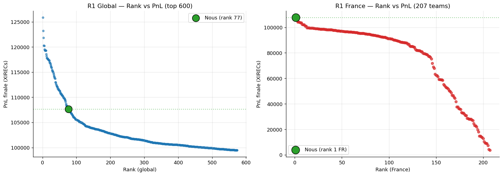
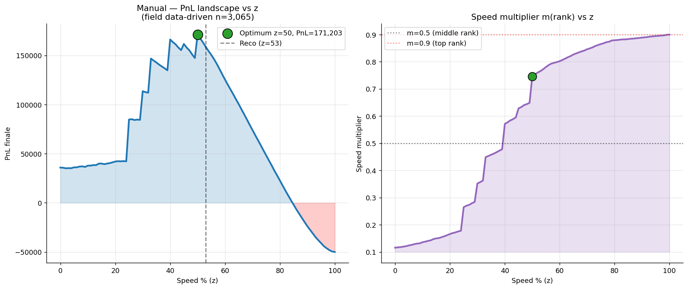
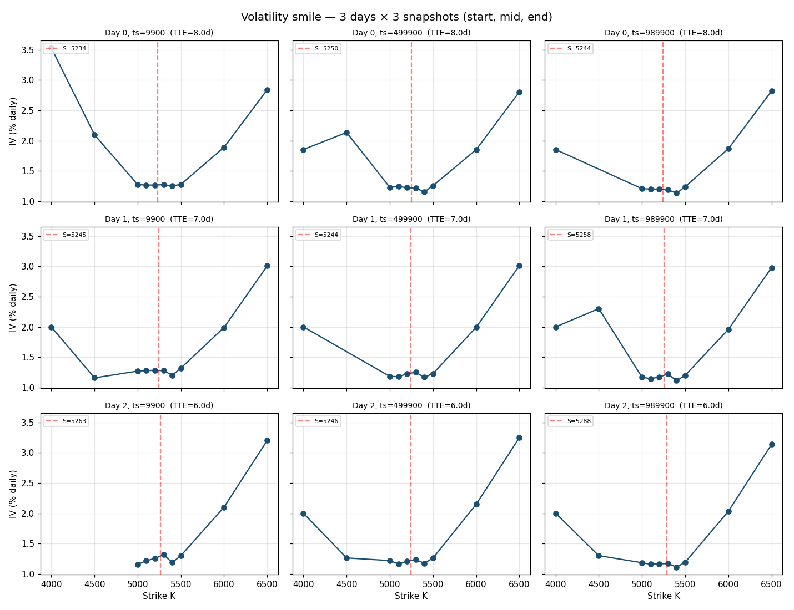
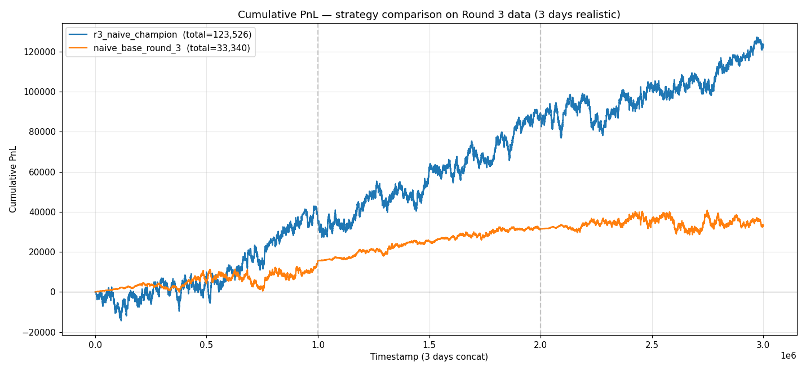
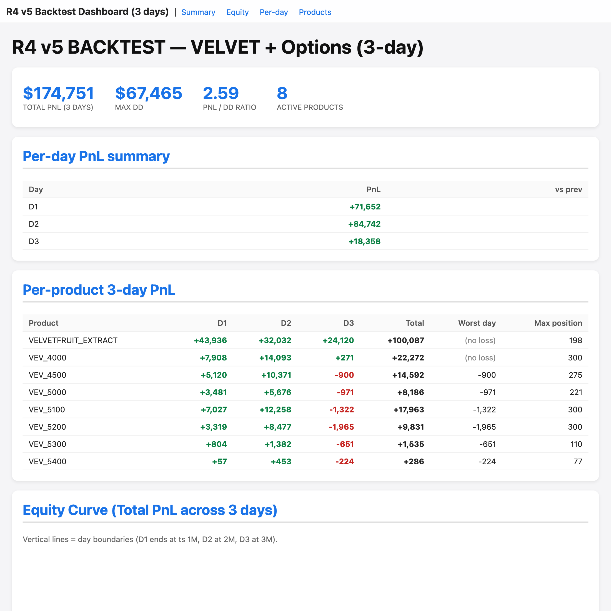
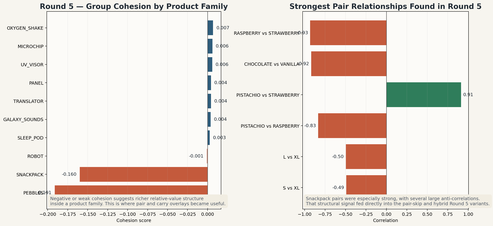

# RELATIVISTIC QUANTS

<p align="center"><strong>IMC Prosperity 4 - Quant Trading Research Repository</strong></p>

<table align="center">
  <tr>
    <td align="center" width="220">
      <a href="https://fr.linkedin.com/in/theoverdelhan">
        
      </a>
      <br>
      <strong>Théo Verdelhan</strong>
      <br>
      Paris Dauphine University
      <br>
      <a href="https://fr.linkedin.com/in/theoverdelhan">LinkedIn</a>
      <br>
      <a href="https://github.com/theov07">GitHub</a>
    </td>
    <td align="center" width="220">
      <a href="https://fr.linkedin.com/in/leorenault">
        
      </a>
      <br>
      <strong>Léo Renault</strong>
      <br>
      Paris Dauphine University
      <br>
      <a href="https://fr.linkedin.com/in/leorenault">LinkedIn</a>
      <br>
      <a href="https://github.com/Leho777">GitHub</a>
    </td>
    <td align="center" width="220">
      <a href="https://github.com/thibaut-dst">
        
      </a>
      <br>
      <strong>Thibaut dst</strong>
      <br>
      University of Chicago
      <br>
      <a href="https://github.com/thibaut-dst">GitHub</a>
    </td>
  </tr>
</table>

<p align="center">
  <em>A six-round quantitative trading archive covering systematic strategy research, manual challenge work, and final integrated submissions.</em>
</p>

---

## Overview

This repository documents **RELATIVISTIC QUANTS**, our entry for the **IMC Prosperity 4** trading competition.

It is closer to a research archive than to a single polished strategy snapshot. The repo preserves the framework we used, the round-specific research we ran, the manual trading and market-design work that accompanied the algorithmic side, and the archived materials behind final candidate selection.

The competition brought together **30,703 players**, **18,803 teams**, **1,549 universities**, and **117 countries**. Our strongest archived algorithmic result was **Round 1: rank 77 worldwide, rank 1 in France**. We finished **rank 514 worldwide** and **rank 17 in France** on the final algorithmic leaderboard.

This repository contains:

- a shared trading framework for configuration, backtesting, diagnostics, and submission assembly
- round-by-round research notes, strategy variants, and preserved review artifacts
- manual trading and market-design analysis treated as quantitative decision problems
- archived candidate submissions and post-submission summaries

## Key Results

- **Round 1 algorithmic leaderboard:** **rank 77 worldwide**, **rank 1 in France**
- **Final algorithmic leaderboard:** **rank 514 worldwide**, **rank 17 in France**

## Repository Guide

This repository is large, so the highest-signal entry points are:

- `prosperity/` shared framework for configuration, strategy modules, backtesting, and diagnostics
- `research/` round-specific studies, notebooks, manual challenge work, and structural analysis
- `scripts/` operational tools for analysis, dashboards, exports, and validation
- `artifacts/submissions/` archived final candidates, selection notes, and round summaries
- `artifacts/analysis/` generated visuals and review outputs
- `team/` internal notes, playbooks, and coordination material
- `docs/` guides, preserved references, and presentation assets

## The Project Story, Round by Round

### Round 0 - Building the base layer

Round 0 was where we created the foundation that the rest of the project depended on.

At that stage, the important thing was not sophistication. It was speed, clarity, and having a common environment that all three of us could trust. We put in place the first shared backtesting workflow, the core strategy configuration pattern, baseline market-making logic, and the first version of the "champion" integration path.

This round matters because it established the discipline used later:

- one place to define active products and limits
- one common backtester
- one way to compare variants
- one export path for competition submissions

Without that structure, the later hybrid work would have been much messier.

### Round 1 - From baseline quoting to signal-aware trading

Round 1 was the first real jump in sophistication. The team moved beyond simple spread capture and began working on more signal-aware quoting behavior, especially around inventory and short-term directional structure.

This is where the repo starts to show differentiated trading research:

- teammate-specific variants appeared more clearly
- regression-style and trend-sensitive logic began to replace purely mechanical baselines
- the framework started to support richer experimentation without breaking the shared workflow

Archived leaderboard analysis preserved in this repo places the team at:

- **107,674 final PnL**
- **rank 77 globally**
- **rank 1 in France**

<p align="center">
  
</p>

<p align="center">
  <em>Archived Round 1 leaderboard analysis later reused in field-modeling work.</em>
</p>

That result became more than a score. It also became data for later rounds, especially when we modeled field behavior and manual challenge dynamics in Round 2.

### Round 2 - Market design, manual optimization, and strategy synthesis

Round 2 is where the project widened beyond pure trading code.

We had two distinct layers of work:

1. **Algorithmic strategy development**
2. **Manual and market design analysis**

On the algorithmic side, the repo shows how strategy ideas started to combine more directly, especially around quoting logic, gap behavior, and order-book exploitation.

On the manual side, we treated the competition problems as quantitative decision problems:

- value estimation for the **Market Access Fee** auction
- break-even analysis
- scenario modeling for adversary behavior
- tournament-regret adjustments
- data-driven optimization for the **"Invest and Expand"** challenge

The final archived recommendation for the Round 2 manual allocation problem was:

- **Research = 12%**
- **Scale = 35%**
- **Speed = 53%**

<p align="center">
  
</p>

<p align="center">
  <em>Round 2 manual work was handled as a quantitative optimization problem rather than a heuristic allocation choice.</em>
</p>

Round 2 is also where the repo starts to show its range:

- trading strategy work
- statistical modeling
- game theory reasoning
- practical decision-making under uncertainty

### Round 3 - Options, volatility structure, and live probing

Round 3 was a major step up in complexity.

The competition introduced an underlying plus a full option chain, and the repo reflects that shift very clearly. Research became much more structured around:

- implied volatility smile analysis
- Greeks and portfolio exposure analysis
- option-chain diagnostics
- live probes to test behavior under competition conditions
- hybrid strategies mixing passive market making, directional filters, and option overlays

The archived Round 3 submissions record a final uploaded candidate at:

- **240,918 backtest PnL**
- **56,858 drawdown**
- **4.237 PnL/DD ratio**

And the round summary archived in the repo also highlights a strong live outcome:

- **+64,195 PnL on a fresh full live session**

<p align="center">
  
  
</p>

<p align="center">
  <em>Round 3 combined option diagnostics, volatility structure work, and direct comparison between strategy families.</em>
</p>

Round 3 is probably the clearest example in the repo of the shift from simple iteration toward broader quantitative research.

### Round 4 - Counterparty-aware alpha and robustness filtering

Round 4 introduced a different kind of challenge: information about who was trading.

That changed the style of research. The repo shows a clear move toward:

- participant-aware log review
- trader-specific flow analysis
- fading specific counterparties
- order-book imbalance adjustments
- selective disabling of components that became toxic in new conditions

This round is also a good example of the team being disciplined rather than dogmatic. We did not insist on keeping every product live just because it had worked before. In the archived notes and final candidates, some products were deliberately disabled or downweighted when the evidence pointed that way.

The best archived Round 4 champion candidate in the repo is:

- **174,751 PnL**
- **67,465 drawdown**
- **2.59 PnL/DD ratio**

<p align="center">
  
</p>

<p align="center">
  <em>The Round 4 dashboard made candidate quality legible through total PnL, drawdown, per-day contribution, and per-product behavior.</em>
</p>

Round 4 demonstrates something important for a reviewer: we were not only generating ideas, but also **filtering**, **rejecting**, and **de-risking** them when the market structure changed.

### Round 5 - Scaling to 50 products and merging specialized alpha

Round 5 was the large-scale systems round.

The problem became much less about a few hand-tuned products and much more about managing a broad universe intelligently. The repository shows the team responding by moving toward:

- structure analysis across product groups
- pair relationships and anti-correlation overlays
- carry-aware behavior
- selective product dropping
- specialist per-product strategies
- hybrid assembly of multiple teammate alpha sources

One of the strongest archived outcomes is a final **hybrid merge** between different research directions:

- pair and carry overlays
- directional and cross-group alpha

The final archived hybrid candidate reaches:

- **1,038,132** 3-day backtest PnL

<p align="center">
  
</p>

<p align="center">
  <em>Round 5 focused on product-group structure, divergence, and where pair relationships were strong enough to justify specialized overlays.</em>
</p>

That number matters, but the more interesting point is how it was achieved:

- by comparing product-level behavior
- by not forcing one global style on every asset
- by combining distinct teammate strengths into one integrated system

Round 5 is the clearest expression of the integration style behind this repo.

## Manual Trading and Market Design

One of the strongest things about this repository is that it does not stop at the algorithmic side.

We also tackled the manual and market-structure parts of the competition as serious quantitative problems.

### Round 2 - "Invest and Expand"

For the manual challenge, we did not just eyeball an allocation. We reconstructed the payoff landscape and modeled the problem as a field-dependent tournament:

- exhaustive and semi-exhaustive scans
- best-response reasoning
- focal-point analysis
- level-k style modeling
- data-driven field assumptions using preserved leaderboard information

That work is one of the best examples in the repo of turning a vague competition prompt into a proper optimization pipeline.

### Round 2 - Market Access Fee auction

We also built a full process to reason about the value of extra market access:

- estimate the incremental value of the fee
- use official logs to calibrate realistic impact
- compute break-even levels
- move from naive expected value to tournament-aware bidding

This is exactly the kind of side-problem that often gets treated casually in competitions. In our case, it became a documented research stream of its own.

### Round 3 and Round 4 - Manual trading remained part of the workflow

Even when the headline technical difficulty moved toward options and counterparties, the manual side was still present in our decision process. The repo keeps the context, the research notes, and the logic used to think about those rounds as complete projects rather than isolated scripts.

### Round 5 - Fee-aware allocation tool

For the final manual challenge, we built a compact optimizer that converts alpha views into allocations under quadratic fees. It is small in code, but very representative in spirit:

- state the economics clearly
- write down the optimization
- make assumptions explicit
- build a reusable decision tool

## Framework Notes

Even though this README stays project-oriented rather than code-oriented, the framework work matters because it is what made the project runnable across six rounds.

At a high level, the shared infrastructure gave us:

- a common backtesting layer
- round-aware configuration
- side-by-side strategy comparison
- robustness diagnostics beyond raw PnL
- official-log parsing and replay tooling
- a path from modular research code to single-file competition submissions
- a lightweight testing layer to keep the framework trustworthy

That infrastructure reduced friction between research and execution. It let us spend more time deciding *what* to test, and less time rebuilding the same workflow every time a new round opened.

## Minimal Quick Start

For anyone who wants to run the repository locally:

```bash
python3 -m venv .venv
source .venv/bin/activate
python3 -m pip install -r requirements.txt
python3 -m pytest tests -q
python3 backtest.py --strategy champion --round 0 --days -2 --execution-rule queue
```

## Why This Repo Matters

The point of this repository is not that it presents a perfect competition outcome.

What it does show is a way of working that carries beyond a trading competition:

- turning messy problems into structured experiments
- combining quantitative reasoning with practical engineering
- collaborating under deadline pressure without losing rigor
- using post-trade review as a real source of research feedback
- integrating multiple people’s strengths into stronger final systems

That is what **RELATIVISTIC QUANTS** really built here.
